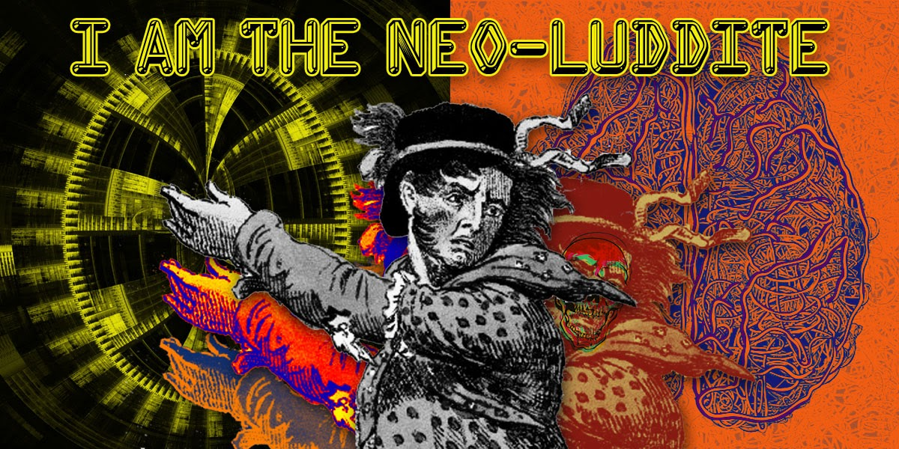

---
# The Positive History and Ethic of Hacker Culture

## The Origins of Hacker Culture

Hacker culture began long before the age of personal computers, rooted in curiosity, creativity, and the desire to understand and improve complex systems. The earliest "hackers" were not digital criminals, but tinkerers and problem-solvers. In the late 19th century, young telephone operators were known to play pranks by switching lines, demonstrating the first playful exploits of technical systems. By the mid-20th century, the term "hacker" emerged at MIT, not in computer labs, but among students modifying model train sets for fun and challenge. This spirit of exploration soon transferred to mainframe computers, where early hackers at MIT and other institutions developed a culture centered on intellectual curiosity, sharing, and the belief that information should be accessible and improvable by anyone willing to learn.[^1][^2]

## The Original Definition of a Hacker

Originally, a "hacker" was someone who delighted in exploring the limits of what was possible, repurposing technology in creative ways, and sharing their findings with others. Hackers saw technology as a playground for ingenuity, not a weapon for harm. This ethic was rooted in openness, transparency, and the joy of collective problem-solving. The early hacker communities valued cleverness, resourcefulness, and the free exchange of ideas, often working collaboratively to push the boundaries of hardware and software.[^3][^4]

## The Hacker Manifesto

A pivotal moment in hacker culture came in 1986 with the publication of "The Hacker Manifesto" (also known as "The Conscience of a Hacker") by Loyd Blankenship, aka The Mentor. Written after his arrest, the manifesto articulated the mindset of hackers as explorers, not criminals:

> "We explore... and you call us criminals. We seek after knowledge... and you call us criminals. We exist without skin color, without nationality, without religious bias... and you call us criminals. You build atomic bombs, you wage wars, you murder, cheat, and lie to us and try to make us believe it's for our own good, yet we're the criminals."

The manifesto championed the idea that hacking was about curiosity, learning, and the pursuit of knowledge for its own sake-a positive, even utopian, vision of what technology and community could become.[^5]

## The Ethic of the Free Software Movement

The positive hacker ethic found its most enduring expression in the Free Software Movement, formally launched by Richard Stallman in 1983 with the GNU Project. Stallman and his peers believed that software should be free-not just in price, but in freedom: the freedom to run, study, modify, and share it. This philosophy was a direct response to the increasing privatization and secrecy in the software industry, which Stallman saw as a threat to the collaborative, open culture that had defined early computing.

The movement’s foundational document, the GNU Manifesto, argued that proprietary software undermined both technical progress and community. The Free Software Foundation, established in 1985, promoted these ideals and developed legal tools like the GNU General Public License (GPL) and the concept of "copyleft," ensuring that software and its derivatives would always remain free and open.[^6][^7][^8]

## DIY Culture and Collective Empowerment

Hacker culture has always overlapped with the broader Do-It-Yourself (DIY) ethos: the belief that anyone can learn, build, and repair technology themselves. This spirit is evident in everything from early computer clubs and bulletin board systems to modern makerspaces and open-source hardware projects. DIY culture rejects passive consumption in favor of active participation and learning by doing.

At its best, hacker culture is about collective empowerment through shared knowledge. Hackers, free software advocates, and DIYers believe that technology should be a tool for liberation, not control. They champion transparency, accessibility, and the idea that everyone should have the means to shape their own digital destiny. This ethic has inspired generations of programmers, activists, and hobbyists to collaborate on projects that benefit the wider community, from Linux and Wikipedia to Creative Commons and beyond.[^9][^10]

## Conclusion

The positive history of hacker culture is a story of curiosity, openness, and the transformative power of shared knowledge. From the playful tinkerers of MIT to the idealists of the Free Software Movement, hackers have shown that technology can be a force for collective good-when it is open, accessible, and shaped by the many, not the few.

```

We explore... and you call us criminals.
We seek after knowledge... and you call us criminals.
We exist without skin color, without nationality, without religious bias... and you call us criminals.

You build atomic bombs, you wage wars, you murder, cheat, and lie to us and try to make us believe it's for our own good, yet we're the criminals.

Yes, I am a criminal. My crime is that of curiosity. My crime is that of judging people by what they say and think, not what they look like. My crime is that

```



---

[^1]: [A Brief History of Hacking](https://www.cobalt.io/blog/history-of-hacking)
[^2]: [How Did Hacker Culture Originate?](https://observer.com/2017/08/how-did-hacker-culture-originate-decentralization-history-of-computers/)
[^3]: [Legendary Groups That Shaped Hacker Culture](https://cybernews.com/editorial/legendary-groups-shaped-hacker-culture/)
[^4]: [Cybersecurity: The History of Hacking and Data Breaches](https://www.monroeu.edu/news/cybersecurity-history-hacking-data-breaches)
[^5]: [The Hacker Manifesto (The Mentor)](https://www.mit.edu/~jcb/hacker.html)
[^6]: [Free Software Movement - Wikipedia](https://en.wikipedia.org/wiki/Free_software_movement)
[^7]: [How Did Free Software Build a Social Movement?](https://blog.jwf.io/2020/04/how-did-free-software-build-a-social-movement/)
[^8]: [History of Free and Open-Source Software - Wikipedia](https://en.wikipedia.org/wiki/History_of_free_and_open-source_software)
[^9]: [FOSS Movements, Digital Rebellion (PDF)](https://scholarspace.manoa.hawaii.edu/bitstream/10125/49730/1/FOSS%20Movements,%20Digital%20Rebellion%20final%20draft.pdf)
[^10]: [Free Software Philosophy - Bellevue College](https://www2.bellevuecollege.edu/artshum/materials/phil/Payne/Spring2005/260/FreeSoftwarePhilosophy.htm)
[^11]: [Hacker Spaces](https://hackerspaces.org/)